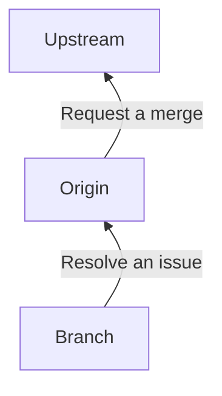

<!--
Copyright (c) 2025 happy

This file can be used by MIT License.
See details at [LICENSE](/LICENSE)
-->

# Goal
This document guides how contributors are joined in the project.

## Repository Guide

We use [Forking Workflow](https://www.atlassian.com/git/tutorials/comparing-workflows/forking-workflow) based on [Github Flow](https://docs.github.com/en/get-started/using-github/github-flow).  
Please follow steps below.

1. Find proper an issue(only one issue is permitted at same branch)
2. Select the issue and assign you.
3. Clone this repository(upstream) to yours(origin).
4. Make a branch to resolve the issue in origin.
5. Resolve the issue and marge the branch to origin.
6. Send a PR to upstream from origin.
7. Review the PR with other contributors.
8. After the PR is accepted, sync origin with upstream and continue `step 1`.

## Issue Guide
You should follow the templates.

- [New Task(Feature)](/.github/ISSUE_TEMPLATE/task-specification.md)
- [Bug Report](/.github/ISSUE_TEMPLATE/bug_report.md)

## Pull Request Guide
You should follow [the template](/.github/PULL_REQUEST_TEMPLATE.md)

## Style Guide
We use [checkstyle and google guideline](https://github.com/checkstyle/checkstyle/blob/master/src/main/resources/google_checks.xml).  
Before sending PRs, please clean updated codes.

#### VS Code
1. Apply `Extension Pack for Java` plugin.
2. Apply `Checkstyle for Java` plugin.
